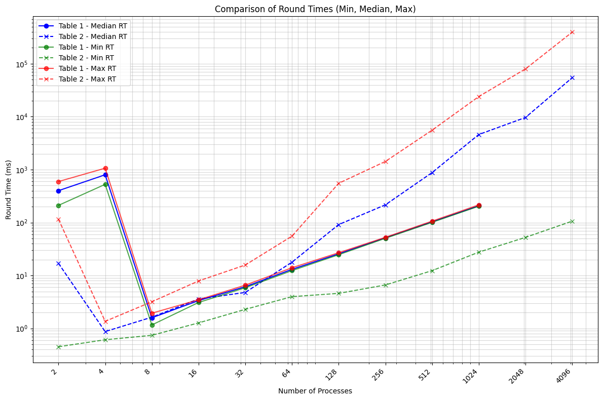

# Task 1: Ein Feuerwerk an UDP-Nachrichten

Die Implementierung in `src_task_1` simuliert eine verteilte Anwendung, die auf einer Token-Ring-Architektur basiert. Das System besteht aus `n` Prozessen, die miteinander kommunizieren, um eine gemeinsame Aufgabe zu erfüllen und unter einer globalen Bedingung zu terminieren.

## Kernfunktionalität

Die Prozesse sind in einem logischen Ring angeordnet. Ein spezielles Nachrichtenobjekt, das "Token", zirkuliert sequenziell von einem Prozess zum nächsten. Nur der Prozess, der das Token besitzt, darf bestimmte Aktionen ausführen, wie das probabilistische Starten eines "Feuerwerks". Die Wahrscheinlichkeit `p` hierfür halbiert sich bei jedem Prozess nach dessen Token-Besitz. Die Kommunikation für das Token erfolgt über Unicast (UDP), während Feuerwerk-Signale und eine finale Terminierungsnachricht über Multicast (UDP) an alle Prozesse gesendet werden.

Prozess P0 nimmt eine Sonderrolle ein: Er initiiert das Token, misst die Umlaufzeiten des Tokens (Rundenzeiten) und überwacht die globale Terminierungsbedingung. Diese Bedingung ist erfüllt, wenn `k` aufeinanderfolgende Token-Runden ohne ein einziges Feuerwerk im gesamten System vergehen. Tritt dies ein, sendet P0 eine Terminierungsnachricht an alle Prozesse. Die Datenerfassung (Rundenzeiten, Anzahl der Feuerwerke) erfolgt primär durch P0 und wird durch ein Launcher-Skript (`task_1_launcher.py`) aggregiert, das die einzelnen Prozessinstanzen startet und deren Log-Ausgaben sammelt.

## Konsistenz in der Anwendung

Das Thema Konsistenz ist in dieser verteilten Anwendung auf mehreren Ebenen relevant:

1.  **Sequenzielle Konsistenz durch das Token:** Das Token stellt eine Form der verteilten exklusiven Kontrolle sicher. Da immer nur ein Prozess das Token hält, werden kritische Aktionen (wie die Entscheidung, ein Feuerwerk zu zünden, oder die Anpassung der lokalen Wahrscheinlichkeit `p`) in einer global definierten Reihenfolge ausgeführt. Dies verhindert Race Conditions bezüglich dieser Aktionen.

2.  **Konsistenz der globalen Zustandsüberwachung (P0):** P0 muss eine konsistente Sicht darauf entwickeln, ob in einer Runde ein Feuerwerk stattgefunden hat. Dies wird erreicht, indem P0 ein internes Flag (`firework_seen_in_current_round_flag`) setzt, sobald es selbst ein Feuerwerk initiiert oder eine Feuerwerk-Multicast-Nachricht von einem anderen Prozess empfängt. Dieses Flag wird bei der Rückkehr des Tokens zu P0 ausgewertet. Obwohl die Multicast-Zustellung inhärente Latenzen aufweist, ist dieser Mechanismus für die Anwendungslogik (die Zählung feuerwerksfreier Runden) ausreichend konsistent.

3.  **Terminierungskonsistenz:** Die Entscheidung zur Beendigung des gesamten Systems wird zentral von P0 getroffen. Die per Multicast versandte `TERMINATE`-Nachricht zielt auf eine eventuale Konsistenz ab: Alle Prozesse werden die Nachricht schließlich empfangen und ihre Ausführung daraufhin beenden. Es gibt keine Garantie, dass alle Prozesse exakt gleichzeitig terminieren, aber das System als Ganzes erreicht einen konsistenten Endzustand.

Zusammenfassend nutzt die Implementierung das Token-Passing für eine starke sequenzielle Konsistenz der Kernaktionen und eine zentralisierte, aber auf Multicast basierende Informationsverteilung für globale Zustandsaspekte und die Terminierung.

# Task 2: Ein Feuerwerk an UDP-Nachrichten (Verteilt)

Die Implementierung in `src_task_2` adaptiert die Token-Ring-Anwendung aus `src_task_1` für eine Ausführung auf zwei physisch getrennten Maschinen (Machine A und Machine B), wobei `n=2` Prozesse simuliert werden. P0 läuft auf Maschine A, P1 auf Maschine B.

## Kernunterschiede zu Task 1

Der Hauptunterschied liegt in der Netzwerkkommunikation und dem Startmechanismus. Anstelle von `localhost` (`127.0.0.1`) für alle Prozesse werden nun explizite IP-Adressen für die Unicast-Token-Weitergabe verwendet. Jeder Prozess (`task_2.py`) erhält beim Start seine eigene IP und die IP des nächsten Prozesses im Ring als Kommandozeilenargumente. Der Launcher (`task_2_launcher.py`) startet P0 lokal und gibt Anweisungen für den manuellen Start von P1 auf der zweiten Maschine. Die Log-Sammlung für P1 erfolgt ebenfalls manuell durch Eingabe des Pfades zur Log-Datei von P1. Die Multicast-Kommunikation für Feuerwerke und Terminierung bleibt konzeptionell gleich, muss aber nun über das physische Netzwerk zwischen den Maschinen funktionieren. Die Socket-Bindungen und Multicast-Gruppenmitgliedschaften sind so konfiguriert, dass sie in einer verteilten Umgebung operieren können.

### Probleme während der Implementierung

Die Umstellung von einer auf localhost laufenden Simulation zu einer IP-basierten hat leider nicht vollständig funktioniert. Individuelle IP-`pings` konnten erfolgreich durchgeführt werden aber die Kommunikation hat letztendlich nicht geklappt.

### Vermutung über Laufzeitverhalten

Da die Experimente für diese Teilaufgabe leider nicht durchführbar waren, werde ich an dieser Stelle kurz meine Vermutungen äußern, wie die Ergebnisse sich unterscheiden könnten. Möglicherweise könnten sich die Latenzen in der Kommunikation zwischen zwei Maschinen maßgeblich erhöhen, da hier nicht nur lokal innerhalb einer CPU mit mehreren Threads kommuniziert wird, sondern zwei wenige Meter voneinander entfernte Computer interagieren.

# Task 3: Ein simuliertes Feuerwerk

Die Implementierung in `src_task_3` repliziert die Funktionalität von `src_task_1` unter Verwendung des Java-basierten Simulationsframeworks `sim4da`. Der Kernunterschied liegt in der Abstraktionsebene: Statt direkter Socket-Programmierung und manuellem Thread-Management wie in Python (`src_task_1`) werden hier die `Node`-, `Message`-, `Network`- und `Simulator`-Klassen des Frameworks genutzt.

## Kernunterschiede zu Task 1

1.  **Sprache und Framework:** Java mit `sim4da` statt Python mit Raw-Sockets.
2.  **Kommunikation:** `sim4da` abstrahiert die Netzwerkkommunikation. Nachrichten (`TOKEN`, `FIREWORK`, `TERMINATE`) werden über Methoden wie `sendBlindly` (Unicast-Äquivalent) und `broadcast` (Multicast-Äquivalent) zwischen benannten `Node`-Instanzen ausgetauscht.
3.  **Nebenläufigkeit:** Das `sim4da`-Framework verwaltet die Threads für jeden `Node`. Die Logik jedes Prozesses wird in der `engage()`-Methode der `SimulatedProcessNode`-Klasse implementiert.
4.  **Experimentsteuerung und Datenerfassung:** Anstelle eines externen Python-Launcher-Skripts, das Subprozesse startet und Logdateien parst, wird in `src_task_3` eine JUnit-Testmethode (`OneRingToRuleThemAll#testTask1SimulationExperiment`) verwendet. Diese Methode orchestriert die Simulationsläufe für verschiedene `n`-Werte, instanziiert die `SimulatedProcessNode`-Objekte und sammelt Ergebnisse direkt von der P0-Instanz (z.B. Rundenzeiten, Gesamtfeuerwerke).

## Konsistenz in der Anwendung

Die Konsistenzmechanismen sind konzeptionell ähnlich zu `src_task_1`, aber ihre Realisierung profitiert von der Simulationsumgebung:

1.  **Sequenzielle Konsistenz:** Das Token-Passing bleibt der Mechanismus zur Sicherstellung der sequenziellen Ausführung kritischer Aktionen. Die Nachrichtenübermittlung des `sim4da`-Frameworks ist innerhalb der Simulation zuverlässig.
2.  **Konsistenz der globalen Zustandsüberwachung (P0):** P0s Logik zur Erkennung von Feuerwerken in einer Runde und zur Zählung feuerwerksfreier Runden ist identisch. Die `broadcast`-Funktion des Frameworks stellt sicher, dass Feuerwerk-Nachrichten (innerhalb der Simulation) alle Knoten erreichen. Dies vereinfacht P0s Aufgabe, eine konsistente Sicht auf den globalen Zustand zu erhalten, da Netzwerkunzuverlässigkeiten wie Paketverlust nicht im Basismodell von `sim4da` auftreten.
3.  **Terminierungskonsistenz:** Die zentrale Terminierungsentscheidung durch P0 und die anschließende `broadcast`-Nachricht führen zu einer zuverlässigen eventualen Konsistenz, bei der alle Knoten ihre `terminateSignal`-Flag setzen und sich beenden. Der `Simulator` wartet, bis alle Knoten-Threads abgeschlossen sind.

# Task 4: Konsistenz
Die Simulation in `src_task_3` bietet eine kontrolliertere Umgebung, in der die Konsistenz der verteilten Logik effektiver und mit weniger Störeinflüssen als bei einer Implementierung mit echten Netzwerk-Sockets (wie in Task 1 oder potenziell Task 2) evaluiert werden kann.

Potenzielle Inkonsistenz bei der Feuerwerk-Erkennung durch P0:

Das kritische Element ist die "Feuerwerk-Rundenintegrität". P0 setzt sein internes Flag fireworkSeenInCurrentRound auf true, sobald es eine "FIREWORK"-Broadcast-Nachricht empfängt oder selbst ein Feuerwerk startet. Wenn P0 das Token zurückerhält, prüft es dieses Flag, um zu entscheiden, ob die gerade beendete Runde ein Feuerwerk enthielt, und setzt das Flag dann für die nächste Runde zurück.

Hier kann eine Inkonsistenz entstehen:

- P0 sendet das Token für Runde X. fireworkSeenInCurrentRound ist false.
- Ein Prozess Pi (i ≠ 0) erhält das Token, startet ein Feuerwerk und sendet eine `FIREWORK`-Broadcast-Nachricht.
Das Token zirkuliert weiter und erreicht P0.
- **Szenario der Inkonsistenz**: Die `FIREWORK`-Nachricht von Pi befindet sich zwar in der Nachrichtenwarteschlange von P0, aber die `TOKEN`-Nachricht wird von P0 zuerst verarbeitet (z.B. wenn sie früher in die Warteschlange kam und `sim4da` standardmäßig FIFO-ähnlich auswählt).
    - P0 verarbeitet das Token: Es prüft fireworkSeenInCurrentRound. Da die `FIREWORK`-Nachricht von Pi noch nicht verarbeitet wurde, ist das Flag (aus Sicht dieser Token-Verarbeitung) `false`. P0 zählt fälschlicherweise eine Runde ohne Feuerwerk.
    - P0 setzt `fireworkSeenInCurrentRound` für die nächste Runde zurück und sendet das Token weiter.
    - Erst danach verarbeitet P0 die `FIREWORK`-Nachricht von Pi aus seiner Warteschlange und setzt `fireworkSeenInCurrentRound` auf `true`. Diese Information gilt nun aber für die nächste Runde (X+1), nicht für die Runde X, in der das Feuerwerk tatsächlich stattfand.
Diese "Race Condition" zwischen der Ankunft/Verarbeitung des Tokens bei P0 und der Ankunft/Verarbeitung von Feuerwerk-Broadcasts anderer Knoten kann dazu führen, dass P0 eine Runde fälschlicherweise als feuerwerksfrei einstuft. Wenn dies k-mal in Folge geschieht, könnte P0 das System vorzeitig terminieren, obwohl die Bedingung (gemäß einer global perfekten Sicht) nicht erfüllt war.